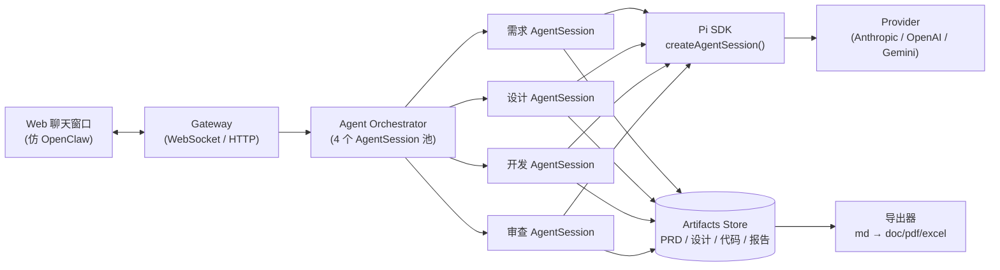
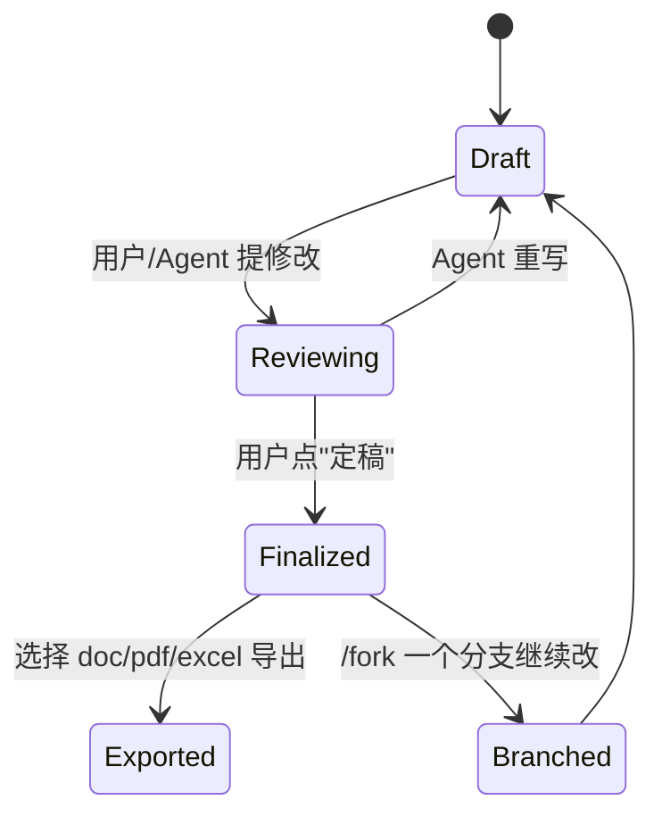

# 全栈智码 · Pi 嵌入设计 + 聊天窗口原型（v0）

<aside>
🎯

**目标**：先做一个仿 OpenClaw 的聊天窗口，把 Pi Coding Agent 真正"嵌进来"跑一遍，验证我们 4-Agent（需求 / 设计 / 开发 / 审查）流水线在 Pi 上的运行方式，再扩展产出物（PRD / 设计 / 代码 / 审查报告）的高可用导出。

本页 = **架构图 + UI 原型 + 可直接落地的 Pi SDK 接入代码**。

</aside>

## 一、先把 Pi 在我们项目里的位置说清楚

### 1.1 Pi 是什么、怎么"嵌入"

Pi（`@earendil-works/pi-coding-agent`）本身是一个**极简的终端 Coding Agent harness**，提供 4 种使用模式：interactive / print(JSON) / RPC / **SDK**。OpenClaw 用的是 SDK 模式 —— 不 spawn 子进程、不走 RPC，而是在自己进程里 `import { createAgentSession }` 直接拿到 `AgentSession` 对象，亲自掌握：

- 会话生命周期 & 事件流（streaming / tool calls / thinking）
- 自定义工具注入（messaging、sandbox、channel-specific actions）
- 每个上下文的 system prompt 定制
- 会话持久化 + **分支（branching）+ 压缩（compaction）**
- 多账号 auth profile 轮换 + 失败转移
- 提供商无关的模型切换（Anthropic / OpenAI / Gemini / Copilot…）

<aside>
💡

**结论**：我们和 OpenClaw 一样走 **SDK 嵌入模式**。每个专业 Agent（需求 / 设计 / 开发 / 审查）= **1 个独立的 `AgentSession` 实例 + 1 套自定义 system prompt + 1 套自定义工具**，由我们的 Gateway 统一编排。

</aside>

### 1.2 4 个 Agent ↔ Pi `AgentSession` 的映射

| 专业 Agent | 核心职责 | System Prompt 重点 | 需要注入的自定义工具 | 主要产出物 |
| --- | --- | --- | --- | --- |
| **需求 Agent** | 从一句话 / 资料 → PRD 定稿 | PRD 模板、用户故事拆解、验收标准、追问规则 | `upload_doc` / `read_doc` / `write_prd` / `export_md_doc_pdf` | `prd.md`（→ doc / pdf） |
| **设计 Agent** | 概要 / 详细 / 接口 / 数据库 / UI 高保真 | 架构风格、接口规范（OpenAPI）、ER 建模、UI 设计语言 | `read_prd` / `write_design_doc` / `gen_openapi` / `gen_er_diagram` / `gen_ui_prototype`（产出可运行 HTML/React 原型） | `design/*.md`  • 一整套可用 UI 原型页面 |
| **开发 Agent** | 前后端代码、可编译部署 | 技术栈约束、目录结构、Lint/CI 规则 | Pi 自带 `read` / `edit` / `write` / `bash`  • 我们扩展的 `scaffold_repo` / `run_build` / `package_release` | 完整 git 仓库 + 构建产物 |
| **审查 Agent** | 代码审查 + 自动化测试 + 报告 | 代码规范、安全检查、测试覆盖标准 | `read` / `grep` / `run_tests` / `static_analysis` / `write_review_report` / `export_md_doc_excel_pdf` | `review.md`  • `test-report.md`（→ doc / excel / pdf） |

### 1.3 整体架构（仿 OpenClaw 的 Hub-and-Spoke）



---

## 二、聊天窗口 UI 原型（仿 OpenClaw + 适配多 Agent）

### 2.1 布局总览（三栏 + 顶部 Agent Tab）

```
┌──────────────────────────────────────────────────────────────────────────────┐
│  🛠️ 全栈智码     [需求] [设计] [开发] [审查]      Provider: Anthropic ▾  ⚙️  │
├──────────────┬──────────────────────────────────────┬──────────────────────┤
│  会话历史     │   聊天主区（消息流 + 流式 + 工具卡）  │  产出物面板           │
│  ──────────  │   ──────────────────────────────────  │  ──────────────────  │
│  · 电商 PRD  │   👤  做一个二手书交易平台...         │  📄 PRD v3 (定稿)    │
│  · 在线教育  │   🤖  好的，我先拆 5 个核心场景...    │  📐 概要设计 v1      │
│  · 当前会话  │   ▸ 工具调用: write_prd(...)          │  🗂️ 接口设计 (草稿)  │
│   └ 分支 a   │     状态: ✓ 写入 prd.md (12.3 KB)     │  🧬 ER 图           │
│   └ 分支 b   │   🤖  PRD 草稿已生成，请确认...       │  🎨 UI 原型 (可预览)  │
│              │                                       │  💻 代码仓库         │
│  + 新会话     │   [输入框]  📎  💭 thinking: medium    │  📋 审查报告         │
│              │   [发送 ↵]   [/compact] [/fork]        │  [导出 md/doc/pdf]   │
└──────────────┴──────────────────────────────────────┴──────────────────────┘
```

### 2.2 关键交互（必须实现）

- [ ]  **顶部 Agent 切换**：4 个 Tab（需求 / 设计 / 开发 / 审查），切换 = 切到对应 `AgentSession`，但**共享同一个会话上下文 ID**（让下游 Agent 能读到上游产出物）。
- [ ]  **流式输出**：订阅 Pi 的 `message_update` 事件，token 级渲染；区分 `text_delta` 和 `thinking_delta`（用折叠卡片显示思考过程）。
- [ ]  **工具调用可视化**：`tool_execution_start / update / end` 渲染成可折叠的"工具卡"（工具名 / 参数 / 输出 / 状态），仿 Claude Code / OpenClaw 的样式。
- [ ]  **会话分支（Tree）**：左侧"会话历史"用树状渲染 Pi 的 session tree（`id` / `parentId`），支持 `/fork`、`/compact`、回到任意节点重写（这就是 PRD/设计稿"反复修改直到定稿"的底座）。
- [ ]  **产出物面板**：右侧实时显示 Pi 工具写出的文件（`write_prd` / `gen_ui_prototype` 等），点击预览（md 渲染 / UI 原型 iframe / 代码 diff）+ 一键导出（md → doc/pdf/excel）。
- [ ]  **输入框**：支持文本、附件上传（资料 → 注入到 Prompt 的 `images` 或 `customTools` 读文件）、`@需求Agent` 跨 Agent 引用、模型/Thinking 等级切换（`session.cycleModel()` / `session.setThinkingLevel()`）。
- [ ]  **Steer / Follow-up**：流式中再发消息时，弹一个小菜单选 "打断重导（steer）" 还是 "等完再说（followUp）"，对应 `session.steer()` / `session.followUp()`。

### 2.3 消息卡片视觉规范（直接照抄落地）

<aside>
👤

**用户消息**

靠右、灰底圆角、支持 markdown 和附件缩略图。

</aside>

<aside>
🤖

**Agent 回复（text）**

靠左、白底、流式打字光标，markdown 渲染含代码高亮。

</aside>

<aside>
💭

**Thinking（可折叠）**

默认折叠，浅紫底，等宽字体，标"思考中..."。

</aside>

<aside>
🔧

**Tool Call 卡**

橙色边框，标题 = 工具名，可展开看参数 / 流式输出 / 最终结果，状态用 ⏳ ▶ ✓ ✗。

</aside>

<aside>
📦

**Artifact 提示**

当工具产出文件时，在消息流里插一条绿色提示："已生成 [prd.md](http://prd.md) (12.3 KB) →【查看】【导出】"，同时在右侧产出物面板高亮。

</aside>

<aside>
⚠️

**错误 / 限流**

红色边框，附"重试 / 切换模型 / 切换 Profile"按钮。

</aside>

---

## 三、Pi SDK 接入关键代码（直接抄）

### 3.1 依赖（和 OpenClaw 完全对齐）

```json
{
	"@mariozechner/pi-agent-core": "0.73.0",
	"@mariozechner/pi-ai": "0.73.0",
	"@mariozechner/pi-coding-agent": "0.73.0",
	"@mariozechner/pi-tui": "0.73.0"
}
```

> 注：上游也发布在 `@earendil-works/pi-coding-agent`，二选一即可，API 一致。
> 

### 3.2 为每个专业 Agent 创建 `AgentSession`

```tsx
import {
	AuthStorage,
	createAgentSession,
	DefaultResourceLoader,
	ModelRegistry,
	SessionManager,
	defineTool,
} from "@earendil-works/pi-coding-agent"
import { Type } from "typebox"

// —— 1. 全局 auth & 模型 ————————————————————————————
const authStorage = AuthStorage.create() // ~/.qzzm/auth.json
const modelRegistry = ModelRegistry.create(authStorage)

// —— 2. 每个 Agent 的 system prompt 用 ResourceLoader 注入 ——
function makeLoader(role: "prd" | "design" | "dev" | "review") {
	return new DefaultResourceLoader({
		cwd: `/workspace/${projectId}`,
		systemPromptOverride: () => SYSTEM_PROMPTS[role], // 我们自己的 4 套 prompt
	})
}

// —— 3. 自定义工具示例：write_prd（产出 md 到工件区） ——
const writePrdTool = defineTool({
	name: "write_prd",
	label: "写入 PRD",
	description: "把最终 PRD 内容写入 artifacts/prd.md，触发产出物面板更新",
	parameters: Type.Object({
		content: Type.String({ description: "PRD markdown 全文" }),
		version: Type.String(),
	}),
	execute: async (_id, { content, version }) => {
		const path = await artifactStore.save(projectId, "prd.md", content, version)
		eventBus.emit("artifact:updated", { kind: "prd", path, version })
		return {
			content: [{ type: "text", text: `prd.md 已写入 (${content.length} 字符)` }],
			details: { path, version },
		}
	},
})

// —— 4. 创建会话 ————————————————————————————————————
async function createRoleSession(role: "prd" | "design" | "dev" | "review", projectId: string) {
	const sessionFile = `/state/projects/${projectId}/sessions/${role}.jsonl`
	const sessionManager = SessionManager.open(sessionFile)
	const loader = makeLoader(role)
	await loader.reload()

	const { session } = await createAgentSession({
		cwd: `/workspace/${projectId}`,
		agentDir: "/state/agent",
		authStorage,
		modelRegistry,
		model: modelRegistry.find("anthropic", "claude-sonnet-4-6"),
		thinkingLevel: role === "dev" ? "high" : "medium",
		customTools: TOOLS_BY_ROLE[role], // [writePrdTool, ...] 等
		sessionManager,
		resourceLoader: loader,
	})
	return session
}
```

### 3.3 把 Pi 事件流接到 WebSocket，喂给前端

```tsx
function wireSessionToSocket(session: AgentSession, ws: WebSocket) {
	const unsub = session.subscribe((event) => {
		switch (event.type) {
			case "message_update":
				if (event.assistantMessageEvent.type === "text_delta")
					ws.send({ kind: "text", delta: event.assistantMessageEvent.delta })
				if (event.assistantMessageEvent.type === "thinking_delta")
					ws.send({ kind: "thinking", delta: event.assistantMessageEvent.delta })
				break
			case "tool_execution_start":
				ws.send({ kind: "tool_start", id: event.toolCallId, name: event.toolName, params: event.params })
				break
			case "tool_execution_update":
				ws.send({ kind: "tool_update", id: event.toolCallId, chunk: event.update })
				break
			case "tool_execution_end":
				ws.send({ kind: "tool_end", id: event.toolCallId, isError: event.isError, result: event.result })
				break
			case "turn_end":
				ws.send({ kind: "turn_end" })
				break
			case "compaction_start":
			case "compaction_end":
				ws.send({ kind: event.type })
				break
		}
	})
	ws.on("close", unsub)
}

// 前端发来 prompt：
ws.on("message", async (msg) => {
	if (msg.kind === "prompt") {
		if (session.isStreaming) {
			await session.prompt(msg.text, { streamingBehavior: msg.behavior ?? "steer" })
		} else {
			await session.prompt(msg.text, { images: msg.images })
		}
	}
	if (msg.kind === "abort") await session.abort()
	if (msg.kind === "compact") await session.compact(msg.instructions)
})
```

### 3.4 Agent 之间的"接力"——把上游产出物喂到下游 Prompt

```tsx
// 用户在 UI 点"基于 PRD 开始设计"
async function handoffPrdToDesign(projectId: string) {
	const prd = await artifactStore.load(projectId, "prd.md")
	const designSession = await sessionPool.get(projectId, "design")
	await designSession.prompt(
		`这是已定稿的 PRD（${prd.version}），请基于它产出概要设计、详细设计、接口设计（OpenAPI）、数据库设计（DDL + ER）四份文档，用对应工具写入 artifacts/design/。\n\n<PRD>\n${prd.content}\n</PRD>`,
	)
}
```

<aside>
🔑

**这是关键**：4 个 Agent 不共享会话历史（各自一份干净的上下文），但**共享同一份 artifacts 工件库**。下游 Agent 通过工具读上游产出物，避免上下文爆炸 + 让"反复修改 PRD/设计/代码"成为受控操作。

</aside>

---

## 四、产出物高可用导出

### 4.1 统一中间格式 = Markdown

所有 Agent 一律先产 `*.md`（PRD / 设计文档 / 审查报告 / 测试报告），再交给统一导出器：

| 目标格式 | 推荐管线 | 备注 |
| --- | --- | --- |
| **.docx** | `pandoc -f markdown -t docx --reference-doc=template.docx` | 提供企业模板，保留封面 / 页眉 / 样式 |
| **.pdf** | `pandoc → LaTeX (xelatex)` 或 `md → HTML → puppeteer` | 含中文用 puppeteer 更稳 |
| **.xlsx**（审查/测试报告） | md 表格 → 解析 → `exceljs` 写表 | 每个表格一个 sheet |
| **UI 高保真原型** | 设计 Agent 工具 `gen_ui_prototype` 直接产出 React/Vite 项目到 `artifacts/ui-prototype/` | 右侧面板用 iframe 预览，可一键 `npm run build`  • 静态托管 |
| **完整代码仓** | 开发 Agent 在 `workspace/{projectId}/repo/` 直接写代码 + `git init`，审查 Agent `bash` 跑 `npm test / pytest` 等 | 用 Pi 自带的 `bash` 工具，沙箱建议开 |

### 4.2 产出物面板的状态机



---

## 五、给你测试用的最小可跑 Demo（Step-by-Step）

这是我建议你**这周就跑通**的最小路径，用来验证 "Pi 在我们需求下怎么运行"：

- [ ]  **Day 1 · 单 Agent 跑通**：只接需求 Agent，前端就是一个最简单的聊天框 + 右侧 PRD 预览。验证 Pi SDK 的 `createAgentSession` + 事件流 + 自定义工具 `write_prd` 能跑。
- [ ]  **Day 2 · 加分支 & 修改**：把 session tree 渲染到左栏，支持"对 PRD 提修改 → Agent 重写 → 用户定稿"，验证 Pi 的 session branching 完全够用。
- [ ]  **Day 3 · 加产出物导出**：md → doc / pdf 走通（pandoc 或 puppeteer 二选一）。
- [ ]  **Day 4 · 接第二个 Agent（设计）**：实现 `handoffPrdToDesign`，验证跨 Agent 工件传递。同时跑通 `gen_ui_prototype` 让设计 Agent 真的产出可预览的 React 页面。
- [ ]  **Day 5 · 接开发 + 审查 Agent**：开发 Agent 直接用 Pi 的 `bash/edit/write`（开 sandbox），审查 Agent 用 `read/grep + run_tests`。打通 "PRD → 设计 → 代码 → 审查报告" 全链路。
- [ ]  **Day 6+ · 优化 UI**：thinking 折叠、tool 卡、多 Profile failover、压缩（compaction）UI 等。

---

## 六、立即就能开工的几个决定点（请你确认）

<aside>
❓

在我开始出代码骨架之前，麻烦你拍板下面 4 件事，我就可以直接生成第一版可跑工程：

1. **前端栈**：React + Vite + Tailwind + shadcn/ui，OK 吗？（仿 OpenClaw 的风格用这套最快）
2. **后端栈 / Gateway**：Node.js（TypeScript）+ Fastify + ws，和 Pi SDK 同一语言、零阻抗，OK 吗？
3. **首选模型**：先默认 `anthropic/claude-sonnet-4-6`（OpenClaw 默认），还是你想用 OpenAI / Gemini / 国产？（Pi 都支持，需要你给到 API Key 的获取方式）
4. **沙箱**：开发 Agent 跑 `bash` 是否需要 Docker 沙箱（OpenClaw 默认是开的，更安全），还是先在本地直接跑？
</aside>

你确认完这 4 点，我下一步就给你输出 **Day 1 单 Agent 可跑工程的完整代码包**（前端聊天窗口 + 后端 Gateway + Pi 接入 + write_prd 工具 + md 导出），你拉下来 `npm i && npm run dev` 就能开始测 Pi。

[全栈智码 · Day 1 单 Agent 可跑工程包（DeepSeek + Pi SDK）](%E5%85%A8%E6%A0%88%E6%99%BA%E7%A0%81%20%C2%B7%20Pi%20%E5%B5%8C%E5%85%A5%E8%AE%BE%E8%AE%A1%20+%20%E8%81%8A%E5%A4%A9%E7%AA%97%E5%8F%A3%E5%8E%9F%E5%9E%8B%EF%BC%88v0%EF%BC%89/%E5%85%A8%E6%A0%88%E6%99%BA%E7%A0%81%20%C2%B7%20Day%201%20%E5%8D%95%20Agent%20%E5%8F%AF%E8%B7%91%E5%B7%A5%E7%A8%8B%E5%8C%85%EF%BC%88DeepSeek%20+%20Pi%20SDK%EF%BC%89%207c419b3849384a018f8df5c3b64ce782.md)